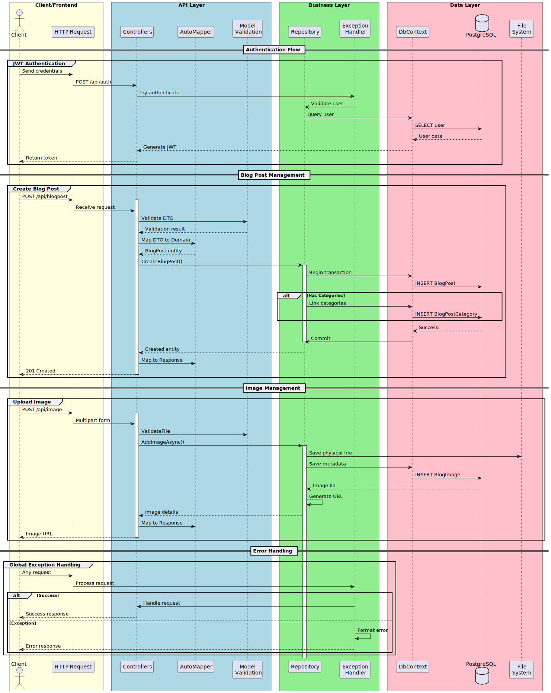

# Post Management API

A robust backend service for blog post management built with .NET 8, featuring RESTful APIs, PostgreSQL integration, and comprehensive image handling.



## Table of Contents
- [Features](#features)
- [Technology Stack](#technology-stack)
- [Project Structure](#project-structure)
- [Getting Started](#getting-started)
- [API Endpoints](#api-endpoints)
- [Database Schema](#database-schema)
- [Docker Support](#docker-support)

## Features

- 🔐 JWT Authentication & Authorization
- 📝 CRUD operations for blog posts and categories
- 🖼️ Image upload and management
- 🔍 Search and filtering capabilities
- 🗄️ PostgreSQL database with Entity Framework Core
- 📚 Swagger API documentation
- 🐳 Docker containerization
- 🔄 Auto-mapper for DTO mappings
- ⚡ Exception handling middleware
- 📊 Response standardization

## Technology Stack

- .NET 8.0
- Entity Framework Core 8.0
- PostgreSQL
- AutoMapper
- Serilog
- Swagger/OpenAPI
- Docker

## Project Structure

```
Post_Management.API/
├── Controllers/
│   ├── BlogPostController.cs
│   ├── CategoryController.cs
│   └── ImageController.cs
├── Data/
│   ├── ApplicationDbContext.cs
│   ├── Models/
│   │   ├── Domains/
│   │   ├── DTOs/
│   │   └── Responses/
├── Repositories/
│   ├── Interfaces/
│   └── Implementations/
├── Middlewares/
│   └── ExceptionHandlerMiddleware.cs
├── Extensions/
│   ├── AutoMapperProfiles.cs
│   └── ValidateFileAttribute.cs
└── Images/
```

## Getting Started

1. Prerequisites:
```bash
# Install .NET 8.0 SDK
# Install PostgreSQL
# Install Docker (optional)
```

2. Clone the repository:
```bash
git clone <repository-url>
cd Post_Management.API
```

3. Configure database connection in appsettings.json:
```json
{
  "ConnectionStrings": {
    "PostgresConnection": "Host=localhost;Database=PostManagementDB;Username=your_username;Password=your_password"
  }
}
```

4. Run migrations:
```bash
dotnet ef database update
```

5. Start the application:
```bash
dotnet run
```

The API will be available at:
- HTTP: http://localhost:5000
- HTTPS: http://localhost:5001
- Swagger UI: http://localhost:5000/swagger

## API Endpoints

### Blog Posts
```
GET    /api/blogpost         - Get all blog posts
GET    /api/blogpost/{id}    - Get blog post by ID
POST   /api/blogpost         - Create new blog post
PUT    /api/blogpost/{id}    - Update blog post
DELETE /api/blogpost/{id}    - Delete blog post
GET    /api/blogpost/url/{url} - Get blog post by URL
```

### Categories
```
GET    /api/category         - Get all categories
GET    /api/category/{id}    - Get category by ID
POST   /api/category         - Create new category
PUT    /api/category/{id}    - Update category
DELETE /api/category/{id}    - Delete category
```

### Images
```
POST   /api/image           - Upload image
GET    /api/image           - Get all images
```

## Database Schema

Key entities:
- BlogPost
- Category
- BlogImage

Relationships:
- BlogPost ⟷ Category (Many-to-Many)
- BlogPost → BlogImage (One-to-Many)

## Docker Support

1. Build the container:
```bash
docker build -t post-management-api .
```

2. Run the container:
```bash
docker run -p 5000:5000 post-management-api
```

Using docker-compose:
```bash
docker-compose up --build
```

## Environment Variables

| Variable | Description | Default |
|----------|-------------|---------|
| ASPNETCORE_ENVIRONMENT | Runtime environment | Development |
| EXTERNAL_API_HOST | External API host | localhost:5001 |
| PostgresConnection | Database connection string | - |

## Error Handling

The API uses a standardized error response format:
```json
{
  "status_code": 400,
  "message": "Error message",
  "reason": "Error reason",
  "is_success": false,
  "data": null
}
```

## Logging

Serilog is configured for logging with console output. Logs are written to:
- Console (all environments)
- JSON files (production)

## Contributing

1. Fork the repository
2. Create your feature branch
3. Commit your changes
4. Push to the branch
5. Create a new Pull Request